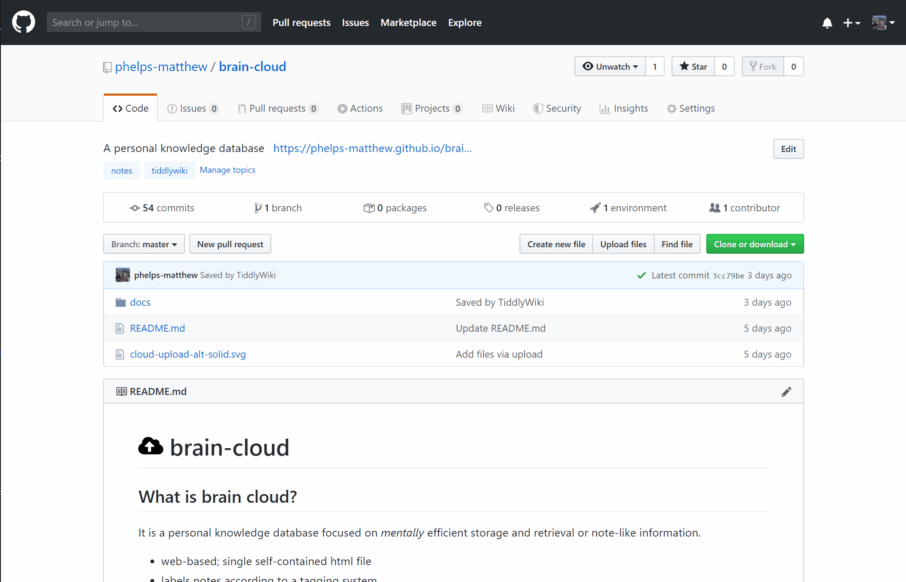

#  brain-cloud

## What is brain cloud?
It is a personal knowledge database focused on *mentally* efficient storage and retrieval of note-like information. 

## Features
* web-based; single self-contained html file
* labels notes according to a tagging system
* tags can be used to organize data into a tree hierarchy
* many productivity features
  - advanced search (regex coming soon)
  - markdown
  - LaTeX
  - code, image, and video embedding
  - syntax highlighting
  - vim navigation

## How do I use it?
Just click here to start exploring!
* <a href="https://phelps-matthew.github.io/brain-cloud/">brain cloud</a>

If you like what you see, simply __save the html and start using it yourself__. There are various mechanisms by which you can save your notes so that they persist. In the brain cloud go to the control panel &#9881; and find the `saving` tab. I use GitHub saver as this allows easy version control, but other great options exist as well.

Here is a bare template brain cloud that I suggest using, as it does not have any existing notes yet.
* <a href="https://phelps-matthew.github.io/brain-cloud/clean">empty brain cloud</a>

## What is brain cloud based on?
It is a tuned web-notebook that is based on an open source project called [TiddlyWiki](https://github.com/Jermolene/TiddlyWiki5). Here's their description:

* TiddlyWiki is a complete interactive wiki in JavaScript. It can be used as a single HTML file in the browser or as a powerful Node.js application. It is highly customisable: the entire user interface is itself implemented in hackable WikiText.

So where does brain cloud fit into this? It represents the completed product of a LOT of hours customizing and tweaking a vanilla flavored TiddlyWiki with a focus on presenting an interface that is tuned for highly productive note taking. 

Put another way, it aims to save you the all the work by delivering a ready-to-go system so you can spend less time tweaking and more time learning!
